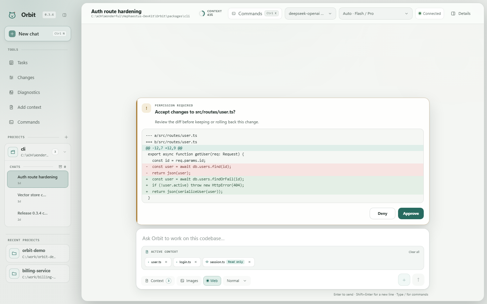

<div align="center">

# Orbit

### Local-first AI coding, with the work left visible.

Orbit is one agent runtime for your terminal, browser, and editor. It can inspect
a repository, make changes, run verification, recover checkpoints, and keep the
entire task understandable while it works.

[](https://www.npmjs.com/package/@orbit-build/cli)
[](https://github.com/Hephaestus-DevKit/Orbit/actions/workflows/ci.yml)
[](https://nodejs.org/)
[](LICENSE)

Windows · macOS · Linux · English · 简体中文 · 繁體中文

[Quick start](#quick-start) · [How it works](#one-runtime-four-ways-to-work) ·
[Safety](#security-and-data-boundaries) · [Documentation](#documentation) ·
[Contributing](CONTRIBUTING.md)

</div>



## Quick start

You need Node.js 20 or newer and an account or local endpoint for your chosen
model provider. Git is recommended for richer checkpoints, rollback, and
isolated agent work; Orbit degrades to filesystem recovery and the main
workspace when Git is unavailable. Then:

```bash
npm install --global @orbit-build/cli
orbit login
cd path/to/your/project
orbit
```

Describe the outcome you want:

```text
Find the cause of the failing tests, fix it, and verify the change.
```

Or use `/` to discover controls:

```text
/model                  Switch provider or model without losing the chat
/goal ship this safely  Keep a durable objective across a long task
/plan                   Inspect or update the recoverable task plan
/webui                  Open the synchronized browser workspace
```

`orbit login` supports DeepSeek, TokenDance, OpenAI, Anthropic,
OpenAI-compatible services, and local Ollama. Credentials use native OS
protection when available and are redacted from configuration, diagnostics,
events, and sessions.

## One runtime, four ways to work

| Surface     | Start with               | Use it for                                                   |
| ----------- | ------------------------ | ------------------------------------------------------------ |
| Terminal UI | `orbit`                  | focused, keyboard-first interactive work                     |
| Web UI      | `/webui`                 | chats, projects, images, Skills, tasks, approvals, and diffs |
| Automation  | `orbit exec "…" --jsonl` | CI, scripts, schemas, and deterministic exit codes           |
| Editor      | VS Code extension        | diagnostics and editor-adjacent completion                   |

The TUI and authenticated local Web UI share the same model, history, active
task, approval state, durable follow-up queue, and cancellation flow. You can
steer a running task at a safe model/tool boundary without throwing away the
work already completed. Queued work can be edited, reordered, removed, or
promoted to steering from the Web UI or the terminal `/queue` command.
`/webui` prints a local authenticated URL before any optional remote model
refresh, so a slow provider cannot delay local startup. Keep its owning
terminal open while you use it.

## Why Orbit feels different

### Context stays deliberate

Orbit combines repository maps, symbols, references, BM25 and vector retrieval,
selected files, project instructions, and opt-in memory into a bounded context
pack. It does not solve relevance by dumping the repository into every prompt.

### Changes stay reviewable

File writes remain inside the authorized workspace. Approval policies,
checkpoints, `/timeline`, `/rewind`, per-file restore, the Changes workbench,
verification contracts, and redacted traces keep consequential work visible and
recoverable.

### Long work stays controllable

Background builds, tests, watchers, and development servers run in one
workspace-owned process runtime with session-isolated access, bounded output,
and process-tree cleanup. They remain observable when you switch chats. Orbit
accounts for their terminal result before declaring the owning task complete,
while cancellation remains responsive during bounded waits.

### Long tasks survive reality

Accepted prompts use durable atomic snapshots. Automatic compaction respects
the active model's context window, and crash recovery does not silently replay
unfinished side effects.

### Execution stays observable

Plans, tools, permissions, timing, cost, cache usage, warnings, and delegated
agents are shown as structured state instead of disappearing into raw logs.
Running planner, coder, and reviewer agents can be steered individually at the
next safe boundary without cancelling their siblings. Concurrent approval
requests are serialized, attributed to the requesting agent, and remain behind
the same permission policy used by single-agent work. Child histories are kept
under `.orbit/agent-sessions` instead of temporary worktrees, and the reusable
`fast`, `balanced`, or `thorough` team recipe stays provider-neutral.
Failed web searches and low-confidence results are never presented as confirmed
facts.

### Provider choice does not reset the conversation

Switch provider or model mid-chat. Orbit recalculates available context while
preserving the project conversation and task state.

## Projects, Skills, and workflows

One Orbit project maps to one codebase folder and can contain multiple
independent chats. The Web UI can switch projects, resume or archive
conversations, and launch an isolated local runtime without flashing an extra
terminal window on Windows.

Reusable expertise belongs in a Skill. Repeatable, user-triggered procedures
belong in a workflow or custom slash command:

```text
.agents/skills/<name>/SKILL.md      Versioned project Skill
.orbit/skills/<name>/SKILL.md       Local project Skill
~/.orbit/skills/<name>/SKILL.md     User Skill
.orbit/commands/<name>.md           Project command
~/.orbit/commands/<name>.md         User command
```

The Web UI provides guided templates, inline validation, enable/disable
controls with failed-save recovery, explicit activation labels, typed input
hints, an editable invocation preview, and portable catalog export. Workflows
may compose up to eight existing Skills; missing or malformed dependencies are
rejected before files are written. The underlying files stay transparent and
versionable. New Skills include `agents/`, `references/`, `scripts/`, and
`assets/`, and can be stored locally or with the repository. Active bundled
resources use `skill://<skill-name>/<relative-path>` addresses. Validate their
links, sizes, and filesystem safety with:

```bash
orbit skills validate --deep
```

## Providers

For an OpenAI-compatible service, enter its exact base URL, including `/v1`
when required. Orbit does not guess URL suffixes. Authenticated provider
catalogs and the local Ollama API populate the model selector with models that
are actually available.

Orbit includes first-class DeepSeek V4 profiles. The official profile refreshes
the live model catalog and exposes stable `Auto`, `deepseek-v4-flash`, and
`deepseek-v4-pro` choices;
dated provider builds (`Flash-0731` and `Pro-0813`) stay in diagnostics. Both
have a 1M context window, a 384K maximum output, and low/high/max reasoning.
DeepSeek's provider default is high; Orbit's Auto router may explicitly choose
low for a simple Flash turn and max for a repair turn. It uses the native
Responses API automatically for both official models, with a pre-output Chat
Completions fallback when that endpoint is unavailable. DeepSeek semantics are
selected by model ID rather than hostname, so TokenDance and future gateways
receive the same reasoning, tool-history, context, and validation behavior.
Other model families stay on the generic compatible path. Set provider
`deepSeekApiFormat` to `auto` or `responses` only when that gateway exposes
Responses; otherwise use `chat-completions`.

| Model               | Best for                     | Agent thinking | Context   |
| ------------------- | ---------------------------- | -------------- | --------- |
| `deepseek-v4-flash` | fast work and summarization  | low/high/max   | 1,048,576 |
| `deepseek-v4-pro`   | planning, coding, and review | low/high/max   | 1,048,576 |

```bash
orbit doctor --probe --deepseek
orbit bench --model deepseek-v4-flash --thinking high --repeat 3 --max-tokens 1024
```

Provider-supplied cache hit and miss usage is reported without synthetic cache
primers or fixed hit-rate claims.

The model versions and limits above follow DeepSeek's
[official model table](https://api-docs.deepseek.com/quick_start/pricing/) and
[Responses compatibility guide](https://api-docs.deepseek.com/guides/responses_api/).

## Connected tools with MCP

Orbit supports validated MCP tools, resources, prompts, and URI templates over
stdio and Streamable HTTP. Connections are scoped to an Agent loop so one chat
cannot inherit another chat's dynamic tools. HTTP endpoints require HTTPS
unless they are loopback, responses are size-bounded, and OAuth authorization
code flows use PKCE with a loopback callback.

Configure MCP servers in `orbit.config.yaml`, then run `orbit doctor` to catch
invalid endpoints or missing environment variables before starting a task. See
the [user guide](docs/USER_GUIDE.md) for the current schema and examples.

## Security and data boundaries

“Local-first” describes Orbit's runtime and state ownership; it does not mean
configured external services receive no data. Orbit keeps chats, checkpoints,
indexes, plans, and project state locally, while sending the prompt and selected
context needed for a request to the model provider you configured. Web search,
fetch, MCP, and extension tools may send their explicit inputs to their own
services.

- File mutations are resolved against the authorized workspace, with approval
  policy and protected-path checks before consequential operations.
- Selective rollback snapshots the worktree and Git index and compensates on
  failure; unresolved merge states are rejected rather than guessed.
- Credentials use native OS protection when available and are redacted from
  configuration, diagnostics, browser events, sessions, and support traces.
- The Web UI binds to loopback and requires a per-run capability token. Treat
  its URL as a secret and keep the owning terminal open.
- Orbit has no default telemetry pipeline. Your configured providers and tools
  remain subject to their own privacy and retention terms.

See [SECURITY.md](SECURITY.md) for the supported-version policy and private
vulnerability-reporting channel.

## Operate with confidence

```bash
orbit doctor                 # local configuration and runtime checks
orbit update --check         # check npm without installing
orbit update                 # confirm before installing an update
orbit backup create          # portable chats, memory, commands, and skills
orbit backup inspect <file>  # validate paths, sizes, and SHA-256 integrity
orbit clean --project        # preview project-owned Orbit data cleanup
orbit clean --user           # preview user-owned Orbit data cleanup
```

Cleanup never removes project source, `ORBIT.md`, or `orbit.config.yaml`.
Interactive deletion requires the exact confirmation `DELETE`; automation must
pass `--yes`. Backups exclude credentials, indexes, caches, temporary state,
and previous exports.

## Documentation

| I want to…                             | Go to                                                                                  |
| -------------------------------------- | -------------------------------------------------------------------------------------- |
| configure and use Orbit                | [User guide](docs/USER_GUIDE.md)                                                       |
| find an exact CLI option               | `orbit --help` or `orbit <command> --help`                                             |
| understand security or report an issue | [Security policy](SECURITY.md)                                                         |
| review user-visible changes            | [Changelog](CHANGELOG.md)                                                              |
| understand usage and redistribution    | [Apache License 2.0](LICENSE) and [third-party notices](THIRD_PARTY_NOTICES.md)        |
| contribute or understand internals     | [Documentation index](docs/README.md) and [maintainer guide](docs/MAINTAINER_GUIDE.md) |
| build extensions, Skills, or workflows | [Extension manifest](docs/EXTENSIONS.md) and [user guide](docs/USER_GUIDE.md)          |

## Architecture

Orbit keeps interfaces, runtime policy, state, and provider protocols separate:

| Layer            | Packages                                      | Owns                                                             |
| ---------------- | --------------------------------------------- | ---------------------------------------------------------------- |
| Interfaces       | `cli`, `tui`, `editors/vscode`                | commands, TUI, Web UI, LSP, editor integration                   |
| Agent runtime    | `core`, `context-engine`                      | planning, execution, memory, compaction, retrieval, verification |
| Models and tools | `model-providers`, `tools`, `mcp`             | providers, built-in tools, background processes, connected tools |
| Trust and state  | `permissions`, `sandbox`, `session`, `config` | approvals, isolation, checkpoints, recovery, credentials, policy |
| Foundations      | `shared`                                      | paths, redaction, IDs, tokens, and bounded utilities             |

Generated `dist`, `coverage`, `test-results`, `node_modules`, scratch
workspaces, and runtime `.orbit` data are not source ownership boundaries. See
the [architecture map](docs/ARCHITECTURE.md) for trust boundaries and review
neighborhoods, and the [maintainer guide](docs/MAINTAINER_GUIDE.md) for change
locations and verification commands.

## Develop

Orbit is a strict TypeScript/ESM pnpm monorepo:

```bash
git clone https://github.com/Hephaestus-DevKit/Orbit.git
cd Orbit
corepack enable
corepack pnpm install --frozen-lockfile
corepack pnpm verify
```

Using `corepack pnpm` guarantees the repository's pinned pnpm version even when
another global pnpm is earlier on `PATH`. Release candidates must pass
`corepack pnpm verify:release`. The gate covers formatting,
linting, every workspace build, the full Vitest suite, critical coverage,
browser tests, installed CLI smoke tests, documentation links, package
contents, third-party notices, and the production dependency audit.

Read [CONTRIBUTING.md](CONTRIBUTING.md) before submitting a change.

## License

Orbit is licensed under the [Apache License 2.0](LICENSE). You may use, modify,
and distribute the project, including commercially, subject to the license's
conditions. Third-party components retain their own terms; see
[THIRD_PARTY_NOTICES.md](THIRD_PARTY_NOTICES.md).
